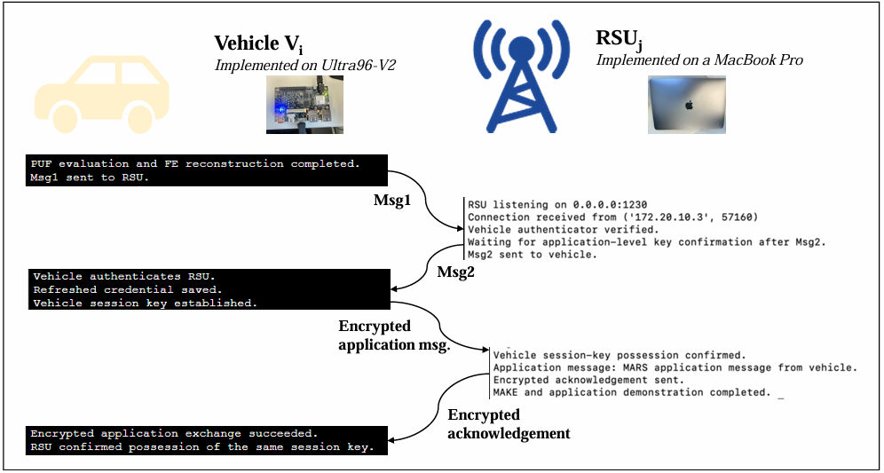
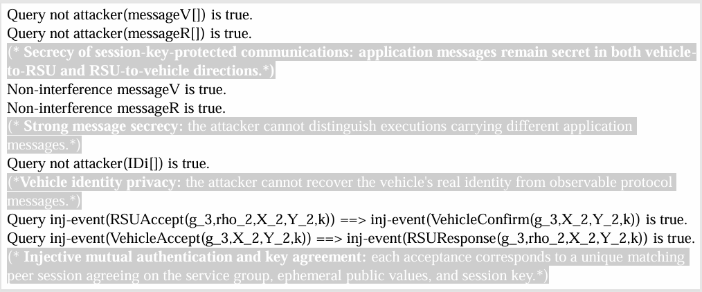

# MARS Supplementary Material

This repository provides supplementary materials for MARS.

## Proof-of-Concept Implementation

The prototype runs on an Ultra96-V2 acting as the vehicle and a MacBook Pro acting as the RSU. The document illustrates the authentication and key-establishment procedure, credential refresh, and the subsequent encrypted application exchange.

## ProVerif Verification Summary

